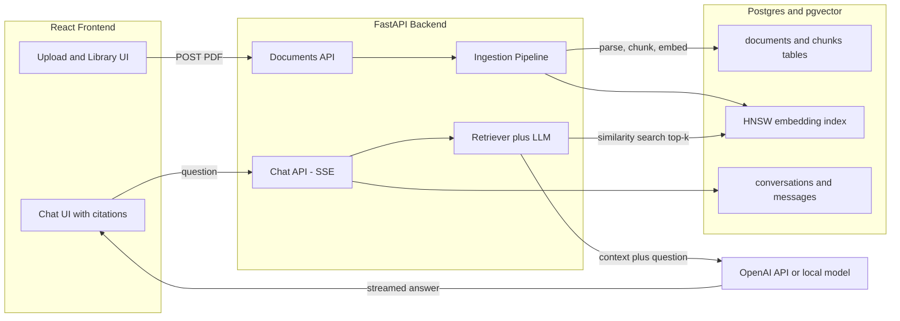

# Enterprise RAG Knowledge Base

Upload dense, multi-page PDFs (legal contracts, research papers, 10-K filings) and chat with them. Answers are generated with retrieval-augmented generation (RAG): grounded in the document text and cited down to the page.

## Quick start

```bash
cp .env.example .env   # add your OPENAI_API_KEY
docker compose up --build
```

Open [http://localhost:5173](http://localhost:5173), drop in a PDF, wait for the status badge to turn `ready`, and start asking questions.

## Architecture



### Ingestion pipeline

1. **Upload** — `POST /api/documents` stores the PDF on disk and creates a `documents` row with status `pending`. Ingestion runs as a FastAPI background task; the UI polls until it finishes.
2. **Parse** — `pypdf` extracts text page by page, so every chunk keeps its page number.
3. **Chunk** — LangChain's `RecursiveCharacterTextSplitter` (~1000 chars, 150 overlap). Pages are split independently, so each chunk maps to exactly one page and citations stay precise.
4. **Embed** — chunks are batch-embedded (`text-embedding-3-small` by default) and inserted into the `chunks` table with a pgvector `vector(1536)` column, indexed with HNSW (cosine).
5. **Ready / failed** — the document row is marked `ready` with page/chunk counts, or `failed` with the error message shown in the UI.

### Query pipeline

1. The question is embedded and pgvector returns the top-k (default 6) most similar chunks, optionally filtered to one document.
2. If every retrieved chunk scores below a similarity threshold, the API answers "I could not find that information" instead of letting the model guess.
3. Otherwise the chunks are formatted as numbered excerpts into a grounding system prompt that instructs the model to answer only from context and cite excerpts as `[1]`, `[2]`, ...
4. The answer streams back over Server-Sent Events. The `sources` event (chunk text, page number, similarity score) arrives before the first token, so provenance is visible immediately.
5. Both turns are persisted to `conversations` / `messages`; follow-up questions include recent history.

### Data model

| Table | Purpose |
| --- | --- |
| `documents` | Uploaded PDFs with ingestion status (`pending → processing → ready / failed`), page and chunk counts |
| `chunks` | Chunk text + `vector(1536)` embedding, page number, HNSW cosine index |
| `conversations` | Chat sessions, optionally scoped to one document |
| `messages` | User/assistant turns; assistant messages store their cited sources as JSON |

### Stack

- **Frontend** — React 18 + TypeScript + Vite, Tailwind CSS, SSE streaming chat with expandable source cards.
- **Backend** — FastAPI, async SQLAlchemy 2, Alembic migrations, `sse-starlette`.
- **Vector store** — Postgres + pgvector: relational data and embeddings live in one database, no extra infrastructure.
- **LLM** — any OpenAI-compatible endpoint. Set `OPENAI_BASE_URL` (e.g. `http://localhost:11434/v1` for Ollama) plus `EMBEDDING_MODEL` / `CHAT_MODEL` to swap providers without code changes.

## Local development (without Docker)

```bash
# 1. Postgres with pgvector (or use: docker compose up db)
#    createdb rag; CREATE EXTENSION vector;

# 2. Backend
cd backend
python3 -m venv .venv && .venv/bin/pip install -r requirements.txt
cp ../.env.example .env   # set OPENAI_API_KEY and DATABASE_URL if not default
.venv/bin/alembic upgrade head
.venv/bin/uvicorn app.main:app --reload --port 8000

# 3. Frontend (proxies /api to localhost:8000)
cd frontend
npm install
npm run dev
```

API docs are served at [http://localhost:8000/docs](http://localhost:8000/docs).

## API surface

| Endpoint | Description |
| --- | --- |
| `POST /api/documents` | Upload a PDF; returns the document with `pending` status and starts ingestion |
| `GET /api/documents` | List documents with status (polled by the UI) |
| `DELETE /api/documents/{id}` | Delete a document, its chunks, and the stored file |
| `POST /api/chat` | Ask a question; SSE stream of `conversation`, `sources`, `token`, `done` events |
| `GET /api/conversations` | List chat sessions |
| `GET /api/conversations/{id}/messages` | Full message history with stored citations |

## Configuration

All settings live in `backend/app/config.py` and are overridable via environment variables / `.env`:

| Variable | Default | Purpose |
| --- | --- | --- |
| `OPENAI_API_KEY` | — | LLM provider key (required) |
| `OPENAI_BASE_URL` | OpenAI | Any OpenAI-compatible endpoint (Ollama, vLLM, ...) |
| `EMBEDDING_MODEL` | `text-embedding-3-small` | Embedding model (`EMBEDDING_DIMENSIONS` must match) |
| `CHAT_MODEL` | `gpt-4o-mini` | Chat completion model |
| `CHUNK_SIZE` / `CHUNK_OVERLAP` | 1000 / 150 | Chunking parameters |
| `TOP_K` | 6 | Retrieved chunks per question |
| `SCORE_THRESHOLD` | 0.15 | Minimum cosine similarity before answering "not found" |

## Production upgrade path

Deliberately deferred from v1 to keep it shippable, in rough priority order:

1. **Auth and multi-tenancy** — scope documents and conversations to users/organizations (row-level `tenant_id` + JWT middleware).
2. **Dedicated ingestion workers** — replace FastAPI `BackgroundTasks` with Celery + Redis (or ARQ) for retries, concurrency limits, and horizontal scaling.
3. **Hybrid retrieval** — combine pgvector similarity with Postgres full-text search (BM25-style) and rerank with a cross-encoder for better recall on exact terms like clause numbers.
4. **OCR fallback** — scanned PDFs currently fail with a clear error; add Tesseract/textract for image-based pages.
5. **Evaluation harness** — golden question/answer sets per document with automated faithfulness scoring to catch retrieval regressions.
